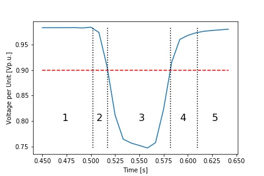

What follows is documentation associated with the distribution Phasor Measurement Unit (PMU) Event Library database, developed at [Lawrence Berkeley National Lab](https://gig.lbl.gov/) (LBNL) with support from the [California Energy Commission](https://www.energy.ca.gov/) (CEC) [Electric Program Investment Charge](https://www.energy.ca.gov/contracts/epic.html) (EPIC) program.

## General
The PMU Event Library serves as a repository of PMU measurement data associated with short-term (generally sub-second) instances of abnormal distribution grid behavior, hereteo termed “events”, as measured on a portion of LBNL’s local distribution grid. Distribution PMUs, which collect data at resolutions of up to 120 Hz (that are 120 samples per second), provide the opportunity to observe grid disturbances such as voltage sags (a momentary decrease in supply voltage) and swells (a momentary raise in supply voltage) in high detail. This reveals system behaviors, i.e. oscillations and transients, which might not be detected with traditional distribution management systems. An example is shown below:

## LBNL PMU Configuration
This package was developed for use at Lawrence Berkeley National Laboratory's [Flexgrid](https://flexlab.lbl.gov/introducing-flexgrid) testing facility, which has been outfitted with an array of distribution-scale  PMUs that provide the data contained within this library. The PMUs are arranged in a layered setup, which allows the study of propagation of grid events. It involves one medium-sized office building (yellow), a testing facility (blue), and a photovoltaic array (red) This inter-relationship between PMUs and the exact grid activity which they measure is also illustrated in the one-line electrical diagram::

(Rendering from Stantec Architecture)

## Structure of Event Library
This [event library](Event_Library) is structured such that event data is split broadly between events that occurred under active photovoltaic (PV) power generation and events that occurred in the absence of active PV power generation. This split is created by the folders “PV” and “No_PV”, respectively. Within these folders, individual events each receive their own folder which is named by the timestamp `%Y-%m-%dT%H%M%S` of the data point which begins the event (in Pacific Standard Time i.e. UTC-8). Within each folder are comma separated value (.csv) files that contain the raw 120 Hertz data associated the event from its beginning to its end with a half-second padding and tailing; separate files exist for each PMU on LBNL’s campus so that event propagation between locations on a single distribution grid may be quantified. Additionally, each event folder contains event parameters for the data associated with each PMU’s raw data; these event parameters capture, among other things, high-level statistics of the raw data such as minimum and maximum rates of change achieved, absolute maximum values recorded, etc. Finally, each folder includes simple line-plot visualizations which illustrate the event data graphically for easy inspection. 

## Event Data Format
The PMU Event Detection package isolates raw data which pertains only to the event in question by combing over raw data to determine the bounds on the event’s start and end times. This is completed by calculating the slope between each consecutive pair of raw data points; once the magnitude of this slope exceeds 1 Volt RMS per cycle for voltage type events, 4 Amp RMS per cycle for current type events, or 0.001 Hertz per cycle for frequency type events, it is determined that the event has initiated. Similarly, once measurables of voltage/current/frequency, etc. have stabilized to within 99% of pre-event values and the slope between consecutive data points has returned to below 1 Volt RMS, 4 Amp RMS, and 0.001 Hertz RMS for voltage, current, and frequency events, respectively, it is determined that the event has concluded. One-half second of data is padded onto the front and back ends of these detected bounds to observe grid behavior immediately preceding and following the disturbance.

Once events have been isolated in the manner outlined above, the package takes a first pass over event data and collects parameters such as minimum/maximum slopes, minimum/maximum data point values, event length, etc. This parameterization is conducted separately in five distinct regions which correspond to the stages of evolution of short-term events with time:

1. The first region captures normal operational data before the event begins.
2. The second region captures data once the event has initiated (by the parameters outlined above) up until the point at which the user-set threshold. is actually crossed. In respect to the [ANSI](https://www.spgsamerica.com/upload/documents/company_green_bar_documents/ansi_c84_1-2016_voltage_ranges_green_bar.pdf) standard (source: SPGS America) this would be +/- 5 % for the U.S. 
3. The third region encompases data which is actively exceeding the user-set threshold.
4. The fourth region captures data which returns back below the threshold until the event has concluded (by the parameters outlined above).
5. The fifth region comprises data which has stabilized back to normal operational data. 

Line plots of event data are presented such that the data of separate PMUs are plotted against one another for voltage and current visualizations; if applicable, the thresholds which constitute voltage/current “events” are also indicated on these plots as red dashed lines. This can be seen in the plot presented above which displays harmonic behavior in time-series raw voltage data.

One example application of the data is the clustering of events and parameter to predict its severity and duration (see below in Swenson et. al. 2019). Here the minimum slope of a voltage sag achieved in region two with the absolute minimum voltage of the entire event achieved in region 3 was correlated and a prediction model was formed. An illustration of these regions superimposed upon a sample voltage sag is illustrated below:

Finally, this repository includes sample clusterings of all events within the PMU Event Library by their time-series voltage and current data. In this way, “classes” of events may be determined to possibly aid in the development of predictive control schemes.

## Third Party Software
The PMU Event Library only includes .csv files as data source. However an instructional Python Jupyter notebook is available familiarize with the data. The requirements are `pandas` and `matplotlib` which are typical packages for data processing in Python.

The dependencies can be installed with `pip install -r requirements.txt`. 

## Getting Started
The following link permits users or developers to clone the source directory containing the the [PMU Event Library](https://github.com/LBNL-ETA/pmu_event_library) package.

Or use `git clone https://github.com/LBNL-ETA/pmu_event_library.git`

User instructions can be found in the form of a guided Jupyter notebook [here](Examples).

In the [Event_Library_Instructional.ipynb](Examples/Event_Library_Instructional.ipynb), a count of total events contained within the library is conducted, event timestamps and columns are described, and a sample event voltage visualization is presented to provide an overview of the library.

## License
PMU event library Copyright (c) 2019, The Regents of the University of California, through Lawrence Berkeley National Laboratory (subject to receipt of any required approvals from the U.S. Dept. of Energy).  All rights reserved.

If you have questions about your rights to use or distribute this software, please contact Berkeley Lab's Intellectual Property Office at IPO@lbl.gov.

NOTICE.  This Software was developed under funding from the U.S. Department of Energy and the U.S. Government consequently retains certain rights.  As such, the U.S. Government has been granted for itself and others acting on its behalf a paid-up, nonexclusive, irrevocable, worldwide license in the Software to reproduce, distribute copies to the public, prepare derivative works, and perform publicly and display publicly, and to permit other to do so.

## Cite
To cite the PMU Event Library, please use:

Swenson, Tucker, Evangelos Vrettos, Joscha Mueller and Christoph Gehbauer. “Open PMU Event Dataset:
Detection and Characterization at LBNL Campus”, IEEE PES Meeting 2019.